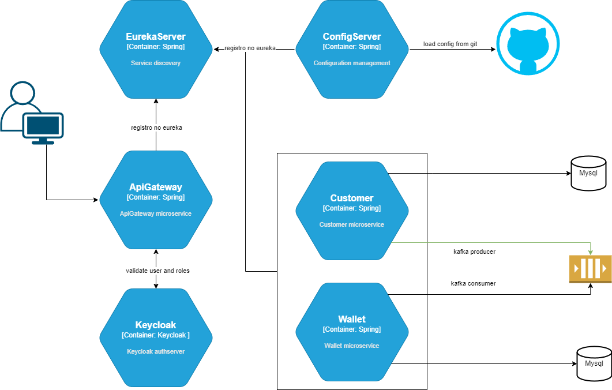
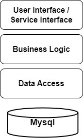

# Getting Started
## Wallet Demo

### Fakepay Architecture Document

**Written By:** Daniel Castro  
**Senior Analyst**  
**Date:** 30/11/2024

## Functional Requirements

| Functionality                         | Http Method | Path                                                                       | Return Codes                             |
|---------------------------------------|------------|----------------------------------------------------------------------------|------------------------------------------|
| Register a new customer               | POST       | /fakepay/customer/api/create                                               | 200 OK   500 Internal Server Error    |
| Fetch a existing customer             | GET        | /fakepay/customer/api/fetch?document=00000000000000                        | 200 OK   500 Internal Server Error    |
| Deposit a value into customer wallet  | PUT        | /fakepay/wallet/api/deposit                                                | 200 OK   417 Expectation Failed   500 Internal Server Error |
| Withdraw a value from customer wallet | PUT        | /fakepay/wallet/api/withdraw                                               | 200 OK   417 Expectation Failed   500 Internal Server Error |
| Fetch wallet balance on date          | GET        | /fakepay/wallet/api/fetchBalanceAt?document=00000000000000&date=YYYY-MM-DD | 200 OK   500 Internal Server Error                             |
| Transfer amount between wallets       | PUT        | /fakepay/wallet/api/transfer                                                                  | 200 OK   417 Expectation Failed   500 Internal Server Error                                                      |

## Examples

### Register a new customer
ex:
{
"name": "Daniel Jose 51",
"email": "danielc551@destination.com",
"document": "01234555883"
}

### Fetch a existing customer
ex:
http://localhost:8000/fakepay/customer/api/fetch?document=01234567890

### Deposit a value into customer wallet
ex:
{
"document": "01234567890",
"transactionValue": 100.00
}

### Withdraw a value from customer wallet
ex:
{
"document": "01234567890",
"transactionValue": 100.00
}

### Fetch wallet balance on date
ex:
http://localhost:8000/fakepay/wallet/api/fetchBalanceAt?document=01234567890&date=2024-12-28

### Transfer amount between wallets
ex:
{
"documentOrigin": "01234567890",
"documentDestination": "01234567891",
"transactionValue": 100.00
}

## Swagger Docs

http://localhost:8080/swagger-ui/index.html

## Non-Functional Requirements

### The following non-functional requirements are met:

- Authentication and Authorization using Keycloak for user management
- Grafana loki for logging
- Grafana prometheus for monitoring
- Grafana tempo for tracing alongside with open-telemetry
- Grafana alloy for alerting
- Eureka for service discovery and load balancing of services
- Spring Cloud Gateway for API Gateway
- Spring Cloud Config for configuration management
- Resilience4j for circuit breaker

## Overall Architecture

### Here architecture of application is shown:

### The architecture comprised of the following services:

- Customer Service - Register a new customer and fetch a existing customer.
    
- Wallet Service - Deposit a value into customer wallet, 
withdraw a value from customer wallet, 
fetch wallet balance on date and transfer amount between wallets.
    
- Gateway Service - API Gateway for the application, 
handling requests from clients 
and routing them to the appropriate services.
    
- Config Server - Configuration server for the application, 
providing dynamic configuration to the application.
    
- Eureka Server - Service discovery and load balancing server for the application.
    
- Database - MySQL database for storing customer and wallet data. 
    
- Kafka Broker - Message broker for the application, 
used for exchange messages between services.
    
- Keycloak Service - Authentication and Authorization server for the application.

## Technology Stack

### The development use the following java technologies:

- Spring Boot
- Spring Cloud Gateway
- Spring Cloud Config
- Spring Cloud Eureka
- Spring Cloud Bus
- Spring Cloud Stream
- Spring Cloud OpenFeign
- Spring Cloud Circuit Breaker
- Spring Cloud Resilience4j
- Spring Cloud Kafka
- Spring Resource Server
- OpenTelemetry
- MySQL
- Kafka
- Grafana Tempo
- Grafana Loki
- Grafana Prometheus
- Grafana Alloy
- Grafana
- Keycloak
- Docker Desktop
- Docker Compose 

### Here the architecture of the customer and wallet service is shown:

#### Service Interface – Exposes REST API for the clients. This layer receives the query requests, and passes them to the Business Logic layer.

#### Business Logic – Receives the query requests from the Service Interface layer, validates them, and passes them on to the Data Access layer.

#### Data Access – Receives the query requests from the Business Logic layer, translate them to a query that can be understood by the database (ie. SQL statements), and returns the results.

---

## How to run the application with docker-compose

#### Requirements:

- Java 17
- Maven 3.8.1
- Docker Desktop
- Docker Compose

#### Inside the project on directory docker-compose/default execute the following command: 

##### `docker compose up -d` to start the application
##### `docker compose down` to stop the application

## Compiling and Running outside docker:

#### mvn clean compile jib:build

#### java -jar target/module*.jar

### Follow the order to run the application:

#### 0 - Database
#### 1 - ConfigServer
#### 2 - EurekaServer
#### 3 - CustomerService
#### 4 - WalletService
#### 5 - GatewayService
#### 6 - KeycloakService

#### If you have some doubt or suggestion, please contact me at: <a href="https://www.linkedin.com/in/daniel-c-2a6618a/" target="_blank">LinkedIn</a>
